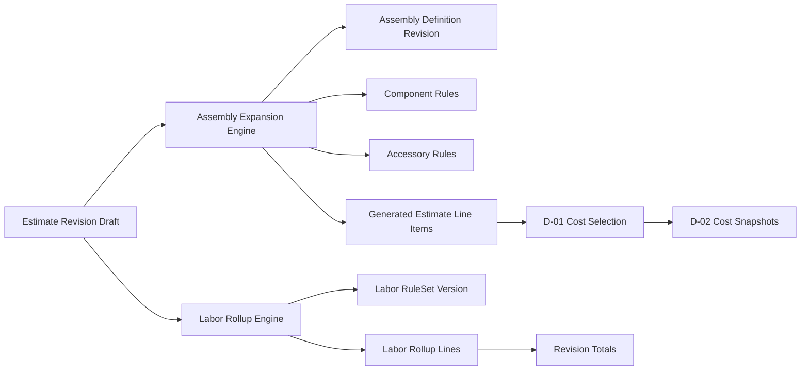

# Assemblies, Accessories, and Labor Rollups (D-03A Architecture)

## Related Documents
- [ESTIMATING.md](ESTIMATING.md)
- [COST_ENGINE.md](COST_ENGINE.md)
- [DOMAIN_MODEL.md](DOMAIN_MODEL.md)
- [ARCHITECTURE.md](ARCHITECTURE.md)
- [COMMERCIAL_KNOWLEDGE.md](COMMERCIAL_KNOWLEDGE.md)
- [PROJECT_REPOSITORY.md](PROJECT_REPOSITORY.md)

## 1. Purpose
D-03A defines architecture only for deterministic assemblies, accessory composition, and labor rollups.

This sprint is documentation-only. It does not implement production code, UI behavior changes, test changes, or migrations.

D-03A must preserve D-01 and D-02 contracts:
- D-01 remains the sole source for deterministic cost selection.
- D-02 remains the sole source for immutable estimate revisions and cost snapshots.
- D-03A composes line structure and labor semantics on top of D-02 without mutating historical facts.

## 2. Scope and Non-Goals
In scope:
- Assembly object model and deterministic expansion behavior.
- Accessory derivation and quantity formulas.
- Labor rollup architecture and rate-set versioning.
- Revision and snapshot integration design with D-02.
- Diagnostics and provenance model for assembly/labor decisions.
- API, transaction, and performance architecture guidance.

Non-goals:
- Sell pricing, margin optimization, proposal generation.
- Procurement execution, POs, accounting, ERP behavior.
- Freight, escalation, tax, and currency conversion implementation.
- AI probabilistic accessory or labor guessing.

## 3. Design Principles
- Deterministic first: same inputs and ruleset versions yield same outputs.
- Immutable history: locked revisions never mutate.
- Explicit provenance: every generated line and labor value references rule and source context.
- Separation of concerns: D-03A composes lines and labor; D-01 selects costs; D-02 snapshots revisions.
- No hidden side effects: expansion and rollups must be explicit user-triggered operations in draft revisions.

## 4. Object Model
### 4.1 New D-03 Domain Concepts (Planned)
- AssemblyDefinition
  - Canonical assembly template owned by Master Library.
- AssemblyRevision
  - Immutable versioned definition for replayability.
- AssemblyComponentRule
  - Deterministic component requirement rule.
- AccessoryRule
  - Deterministic accessory derivation from component/product/system context.
- AssemblyExpansionResult
  - Deterministic result set for generated material lines.
- LaborRuleSet
  - Versioned deterministic labor factors and methods.
- LaborRollup
  - Revision-scoped summarized labor outcome for one estimate revision.
- LaborRollupLine
  - Labor category and quantity basis output row.

### 4.2 D-02 Object Reuse (Implemented)
- EstimateRevision and EstimateLineItem remain authoritative containers.
- CostSnapshot remains immutable line-level pricing record.
- EstimateDiagnostic and EstimateTotals remain readiness and totals authority.

### 4.3 Identity Keys (Required)
- assembly_id, assembly_revision_id
- component_rule_id, accessory_rule_id
- labor_ruleset_id, labor_ruleset_version
- expansion_run_id, labor_rollup_id

## 5. Relationship Diagram

## 6. Deterministic Assembly Expansion
### 6.1 Expansion Inputs
Required inputs:
- estimate_id, revision_id (must be draft)
- product resolution context for originating lines
- assembly_definition_revision_id
- quantity basis context (requested/engineering/procurement)
- ruleset versions (assembly, accessory, estimate)

### 6.2 Expansion Rules
- Expansion is explicit per selected originating line or selected assembly insertion action.
- Generated lines are revision-scoped line items with deterministic lineage fields:
  - origin_line_item_id
  - assembly_revision_id
  - generation_rule_id
  - generation_run_id
- No in-place mutation of locked or superseded revisions.

### 6.3 Nested Assemblies and Cycles
- Nested assemblies are permitted with deterministic depth-first expansion order.
- Cycle detection is mandatory:
  - assembly A -> B -> A is terminal error.
- Cycle errors produce blocking diagnostics and abort expansion transaction.

## 7. Accessory Quantity Architecture
Accessory quantity must be formula-based and explicit:
- Per-each: accessory_qty = parent_qty * factor
- Per-system: accessory_qty = system_count * factor
- Per-room: accessory_qty = room_count * factor
- Threshold/step: accessory_qty = ceil(parent_qty / step) * factor

Rules:
- Quantities must produce deterministic Decimal-normalized outputs.
- Rounding policy is explicit in rule metadata.
- Missing formula inputs produce deterministic diagnostics, not inferred defaults.

## 8. Consolidation and De-duplication
Generated lines may be consolidated only when all keys match:
- canonical product id
- UOM
- section/system/room bucket
- source-selection status semantics
- manual selection flags

If keys diverge, lines remain separate to preserve traceability.

Consolidation emits provenance:
- consolidated_from_line_ids
- consolidation_rule_id

## 9. Labor Rollup Architecture
### 9.1 Labor Input Model
Labor rollup consumes:
- estimate revision line composition
- equipment/system/room context
- labor ruleset version
- optional project complexity factors (deterministic and versioned)

### 9.2 Labor Output Model
LaborRollupLine fields:
- labor_category
- quantity_basis_type and quantity_basis_value
- factor
- calculated_hours
- confidence
- calculation_method
- rule_ids_applied

LaborRollup fields:
- labor_rollup_id
- estimate_id, revision_id
- labor_ruleset_version
- total_hours_low, total_hours_expected, total_hours_high
- diagnostics
- generated_at

### 9.3 Rate-Set Versioning
Labor rates are externalized and versioned:
- labor_rate_set_id
- labor_rate_set_version
- effective_date window

D-03A architecture stores rate-set references for replayability but does not define sell-price calculations.

## 10. Provenance and Traceability
Each generated material or labor artifact must capture:
- generation_run_id
- ruleset versions
- source line or source assembly identity
- rule decision path
- timestamp and actor

This supports:
- exact replay
- deterministic diff between revisions
- mission-control explainability

## 11. Revision and Snapshot Integration (D-02 Contract)
- Assembly expansion writes draft EstimateLineItem records only.
- Cost selection still runs through D-01 and produces CostSnapshots via D-02 service.
- Labor rollup writes revision-scoped rollup records and contributes to totals view.
- Locking a revision freezes assembly-derived lines, snapshots, and labor rollup references.

Locked refresh behavior remains unchanged:
- If refresh is requested against locked revision lines, clone to new draft first.

## 12. Refresh and Recalculation Semantics
Three explicit operations:
- Re-expand Assemblies
  - Re-run assembly/accessory logic against current draft and selected ruleset.
- Recalculate Labor
  - Re-run labor rollup against current draft and selected labor ruleset.
- Reselect Costs
  - Existing D-01/D-02 reselection flow, independent of assembly/labor generation.

No operation silently triggers another unless explicitly requested.

## 13. Overrides and Governance
Supported override categories (planned):
- Accessory inclusion override
- Accessory quantity override
- Labor category hour override

Rules:
- Overrides require reason, actor, timestamp.
- Overrides never mutate historical locked revisions.
- Override provenance persists original automatic value plus manual value.

## 14. Diagnostics and Readiness
Representative diagnostic codes:
- assembly_cycle_detected (blocking)
- missing_assembly_definition (blocking)
- missing_accessory_formula_input (warning or blocking by policy)
- labor_ruleset_unavailable (blocking)
- consolidation_conflict (informational)

Readiness integration:
- D-03 diagnostics feed EstimateDiagnostic in D-02 revision scope.
- Blocking diagnostics prevent lock transition.

## 15. Transaction Boundaries
Atomic transactions required:
- expand_assembly_into_revision
- recalculate_labor_rollup
- accept_assembly_refresh
- apply_override

Each transaction must either:
- fully persist all related line/rollup/provenance records, or
- persist nothing and return deterministic diagnostics.

## 16. API Surface (Design Only)
Planned service operations:
- create_assembly_definition
- create_assembly_revision
- expand_assembly
- preview_assembly_expansion
- reconcile_generated_lines
- recalculate_labor_rollup
- compare_labor_rollups
- apply_assembly_override
- apply_labor_override
- validate_revision_d03

Contract conventions:
- explicit request/response models
- deterministic ordering of returned rows
- no hidden writes from read/preview APIs

## 17. UI Architecture Notes (No Behavioral Changes in D-03A)
D-03A defines architecture targets only:
- BOM Review continues to own pre-estimate composition context.
- Estimate Workspace continues to own revision-level estimating operations.
- Mission Control continues to consume recommendation and readiness signals.

Future UI implementation should preserve existing navigation model and add D-03 workflows as explicit actions in relevant pages.

## 18. Performance and Determinism
Performance requirements:
- Expansion and labor recalculation should be linear with respect to generated line count in standard cases.
- Deterministic ordering guarantees for line IDs and rollup rows.
- Stable hashing inputs for run IDs and replay.

Guardrails:
- configurable max expansion depth
- configurable max generated lines per operation
- deterministic timeout diagnostics for excessive graph expansion

## 19. Migration and Backward Compatibility
Compatibility requirements:
- Existing D-02 revisions without D-03 artifacts remain valid.
- D-03 artifacts are additive and versioned.
- Replay of pre-D-03 revisions remains unchanged.

No database migration plan is defined in D-03A because this sprint is architecture documentation only.

## 20. Testing Strategy (Implementation Planning)
When D-03 implementation starts, add deterministic tests for:
- nested expansion and cycle detection
- accessory quantity formulas and rounding behavior
- consolidation rules and provenance
- labor rollup reproducibility across ruleset versions
- lock/clone refresh behavior with generated lines
- replay and revision comparison for assembly/labor deltas

## 21. Risk Register
- Rule explosion risk: mitigate via versioned rulesets and strict scope boundaries.
- Hidden coupling risk: mitigate with hard API boundaries between D-03 and D-01/D-02.
- Traceability dilution risk: mitigate with mandatory provenance on all generated artifacts.
- Performance regression risk: mitigate with depth/line caps and deterministic diagnostics.

## 22. Open Design Decisions and Recommendations
1. Should assemblies generate persistent child lines or virtual projections?
Recommendation: persistent generated lines in draft revisions.
Rationale: aligns with D-02 revision comparison, validation, and immutable lock behavior.

2. Should accessory rules execute before or after consolidation?
Recommendation: execute before consolidation.
Rationale: preserves rule-level provenance and allows deterministic consolidation afterward.

3. Which quantity basis should drive accessory formulas by default?
Recommendation: engineering quantity default, with explicit override per rule.
Rationale: best aligns with design-intent composition while preserving explicit procurement overrides.

4. Can labor rollup write directly onto line labor fields?
Recommendation: no direct mutation; store rollup outputs separately and project views into totals.
Rationale: avoids destructive edits and preserves replay semantics.

5. Should labor rates be embedded in labor rules?
Recommendation: no; separate labor ruleset from labor rate-set version.
Rationale: keeps labor effort logic independent from localized rate changes.

6. How should nested assembly depth be constrained?
Recommendation: configurable max depth with deterministic hard stop diagnostic.
Rationale: prevents runaway expansions while remaining explicit and auditable.

7. How should manual overrides interact with subsequent re-expand operations?
Recommendation: preserve overrides unless user selects reset-to-automatic.
Rationale: protects estimator intent and avoids silent override loss.

8. Should generated line IDs be hash-based or sequence-based?
Recommendation: hash-based using revision, origin, assembly revision, and rule path.
Rationale: stable reproducibility across deterministic re-runs.

9. Where should D-03 diagnostics be surfaced?
Recommendation: normalized into existing EstimateDiagnostic model.
Rationale: one readiness pipeline and lock gate in D-02.

10. Should D-03 trigger automatic D-01 reselection on every re-expand?
Recommendation: no automatic reselection by default.
Rationale: keep operations explicit and avoid hidden cost mutations.

## 23. Recommended Implementation Order (Future)
1. Domain contracts for assembly/accessory/labor rollup objects.
2. Pure deterministic expansion engine with cycle checks.
3. Labor rollup engine with ruleset versioning.
4. Revision integration adapters into D-02 draft workflows.
5. Validation/readiness integration and diagnostics.
6. UI actions and review surfaces.

## 24. Go/No-Go Checklist for D-03 Implementation Start
Go only when:
- D-03 object contracts are frozen and reviewed.
- Ruleset versioning approach is approved.
- Replay behavior for pre-D-03 and post-D-03 revisions is specified in tests.
- Mission Control and Estimate Workspace touchpoints are scoped with no boundary violations.
- Non-goals remain explicitly enforced.
