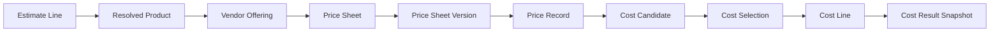
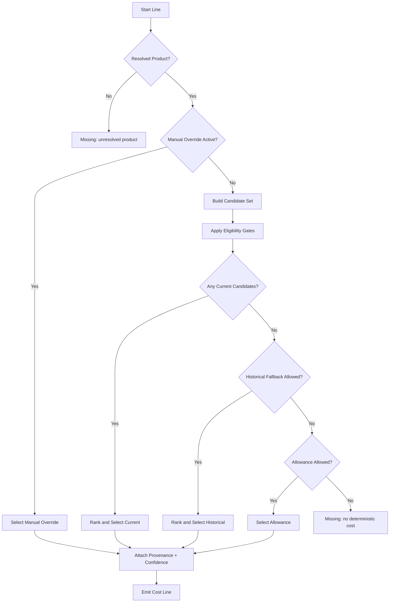
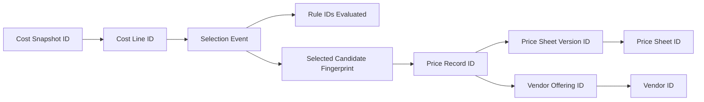
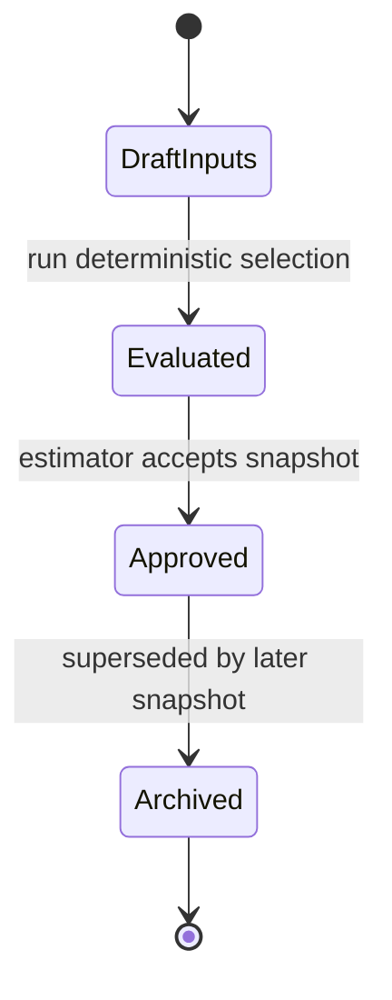

# Atlas Deterministic Cost Engine

Architecture baseline finalized in D-00; D-01 Core Cost Selection Engine is implemented and closed.

## Current Scope Status
- D-01 implemented and closed: deterministic acquisition cost selection and explainability API surface.
- D-02 implemented: consumes D-01 cost-selection APIs for immutable estimate cost snapshots.
- D-03 remains deferred.
- Non-goals preserved: sell pricing, margin strategy, procurement execution, purchase orders, proposal generation.

## Related Documents
- [ESTIMATING.md](ESTIMATING.md)
- [COMMERCIAL_KNOWLEDGE.md](COMMERCIAL_KNOWLEDGE.md)
- [PRICE_VERSIONING.md](PRICE_VERSIONING.md)
- [PRICING_ENGINE.md](PRICING_ENGINE.md)
- [DOMAIN_MODEL.md](DOMAIN_MODEL.md)

## 1. Purpose and Boundary
The Deterministic Cost Engine selects acquisition cost for a resolved product at a specific point in time with full provenance and replayability.

The engine must always produce deterministic outcomes:
- explainable
- reproducible
- traceable
- immutable-reference based

In scope:
- acquisition cost selection
- effective-date and version validity resolution
- deterministic vendor/channel precedence
- deterministic confidence and exception signaling

Out of scope:
- product resolution
- AI recommendation behavior
- procurement execution
- purchase orders
- sell pricing, margin optimization, proposal generation
- freight calculation implementation
- escalation implementation

## 2. Deterministic Design Principles
- No implicit defaults for missing business-critical fields.
- No random, weighted, or probabilistic tie-breaking.
- No mutation of historical price facts.
- Every selected cost references immutable commercial artifacts.
- Every fallback is explicit and auditable.
- All override behavior is policy-driven and logged.

## 3. Domain Context and Object Relationships
The cost engine consumes resolved products from estimating/resolution and immutable commercial history from Commercial Knowledge.



## 4. Cost Source Hierarchy
Cost source classes and deterministic precedence:

1. Manual Override Cost (active, unexpired override only)
2. Project Quote Cost (project-scoped, approved quote)
3. Contract Cost (future object; not implemented in D-01)
4. Preferred Vendor Current Price Record
5. Preferred Purchasing Channel Current Price Record
6. Manufacturer Direct Current Price Record
7. Authorized Distributor Current Price Record
8. Dealer/Reseller Current Price Record
9. Other Active Vendor Current Price Record
10. Historical Price Record (explicit historical fallback)
11. Explicit Allowance Cost (only when policy permits)
12. Missing Cost (terminal no-selection state)

Rules:
- Higher class always outranks lower class.
- Cost source class is stored in selected cost provenance.
- Future contract pricing is reserved with explicit placeholder status until object exists.

## 5. Effective Date Resolution
As-of evaluation is based on a required evaluation date: cost_as_of_date.

Version validity rules for Price Sheet Version:
- valid_from = effective_date (inclusive)
- valid_to = expiration_date (inclusive when present)
- open-ended when expiration_date is null

Price Record validity rules:
- record-effective date defaults to version effective date unless overridden
- record-expiration date defaults to version expiration date unless overridden

Deterministic window logic:
- current: valid_from <= as_of <= valid_to
- future: valid_from > as_of
- historical: valid_to < as_of

Overlapping active records for same product/vendor are resolved by deterministic tie-break:
1. Narrowest validity window first (more specific)
2. Latest effective_date
3. Latest import_timestamp
4. Lexicographic minimum of price_record_id

Future and historical behavior:
- Future records are never selected as current.
- Historical fallback allowed only when current path has no selectable record.
- Historical selection must emit explicit fallback reason and reduced confidence.

## 6. Vendor Selection and Channel Rules
Vendor eligibility gates before ranking:
- vendor active
- product active
- vendor offering active
- compatible currency path exists
- unit conversion requirements satisfiable

Preferred selection inputs:
- preferred_vendor_id (project or org scope)
- preferred_purchasing_channel
- manual vendor lock (line-level)

Selection modes:
- manual vendor selection: hard constraint to specific vendor offering
- automatic vendor selection: deterministic ranking with policy precedence

Deterministic channel order (when no manual lock):
1. manufacturer_direct
2. authorized_distributor
3. regional_distributor
4. dealer_reseller
5. buying_group
6. marketplace
7. other

Tie-break sequence within same precedence tier:
1. lower normalized unit acquisition cost
2. fresher import timestamp
3. shorter lead_time bucket
4. lexicographic minimum vendor_offering_id

## 7. Cost Selection Algorithm



Candidate exclusion conditions:
- expired and superseded by valid current candidate
- duplicate candidate fingerprint
- invalid currency path
- missing required UOM conversion
- inactive vendor/product/offering

Special-state handling:
- missing pricing: terminal missing state with error code
- expired pricing: selectable only as explicit fallback
- multiple valid prices: deterministic tie-break, plus conflict warning
- future pricing only: unavailable_for_as_of error state
- duplicate pricing: deduplicate by fingerprint, preserve duplicate warning
- manual overrides: highest precedence while active and authorized

## 7.1 D-01 Core Selection API Surface
The D-01 implementation exposes explicit deterministic APIs in `DeterministicCostEngine`:
- `select_cost(request, commercial_state=...)`
- `list_eligible_candidates(request, commercial_state=...)`
- `evaluate_candidate(candidate)`
- `explain_candidate_rejection(candidate)`
- `compare_candidates(left, right)`
- `preview_quantity_normalization(...)`
- `get_selection_provenance(result)`
- `get_confidence_breakdown(result)`

Request/result contracts are represented by:
- `CostSelectionRequest`
- `CostSelectionResult`
- `CostProvenance`
- `CostSelectionDiagnostic`
- `CostSelectionResultStatus`

## 8. Cost Provenance Requirements
Every selected cost must include immutable provenance fields:
- vendor_id and vendor_name
- vendor_offering_id
- price_sheet_id
- price_sheet_version_id
- price_record_id
- source_filename
- import_timestamp
- effective_date
- expiration_date
- currency
- selection_rule_id
- selection_timestamp

Recommended additional trace fields for D-01:
- candidate_fingerprint
- selection_path (ordered rules evaluated)
- as_of_date
- policy_version
- override_reference_id (if applicable)

Traceability chain diagram:



## 9. Unit Conversion Architecture
Unit conversion is deterministic and explicit.

Required concepts:
- pricing_uom (record UOM)
- estimate_uom (line UOM)
- pack_quantity
- minimum_order_quantity
- purchase_multiple
- conversion_factor

Conversion rule:
$$
	ext{normalized\_unit\_cost} = \frac{\text{quoted\_cost\_per\_pack}}{\text{pack\_quantity} \times \text{conversion\_factor}}
$$

Extended quantity normalization:
$$
	ext{purchasing\_quantity} = \left\lceil \frac{\max(\text{estimate\_qty},\ \text{MOQ})}{\text{purchase\_multiple}} \right\rceil \times \text{purchase\_multiple}
$$

Architecture rules:
- if conversion path is missing, candidate is invalid (do not guess)
- conversion table version must be referenced by selected cost
- pack/MOQ effects are represented in both unit and extended outputs
- assembly support reserved via componentized conversion graph (placeholder)

## 10. Currency Architecture (Future Ready)
Current baseline may assume USD, but design must support multi-currency deterministically.

Required objects:
- CurrencyRateTable
- CurrencyRateVersion
- CurrencyRateRecord

Selection policy:
- if candidate currency equals estimate currency, no conversion
- else select exchange rate by as_of_date from immutable rate version history
- converted amounts store both source and converted values plus rate provenance

Required fields per cost line:
- source_currency
- target_currency
- fx_rate
- fx_rate_date
- fx_rate_record_id
- converted_unit_cost

Invalid currency path behavior:
- emit invalid_currency_path error
- candidate excluded from deterministic selection

## 11. Freight Placeholder Architecture
Freight is not implemented in D-01, but model reserve is required.

Placeholder objects:
- FreightPolicy
- FreightClass
- FreightScenario

Reserved attributes on cost output:
- freight_class_id
- drop_ship_flag
- freight_included_flag
- freight_estimate_placeholder

Rules:
- freight fields do not alter base acquisition cost in D-01
- placeholder values must be clearly marked non-binding

## 12. Escalation Placeholder Architecture
Escalation is not implemented in D-01.

Placeholder objects:
- EscalationPolicy
- EscalationCurve
- EscalationScenario

Reserved escalation categories:
- inflation
- project_escalation
- vendor_escalation
- contract_escalation

Rules:
- no automatic escalated cost in D-01 base selection
- escalation fields are advisory placeholders only

## 13. Estimate Reproducibility and Immutability
Reproducibility requirement: re-running years later with same snapshot inputs yields identical output.

Immutable reference chain:
1. estimate_snapshot_id
2. product_resolution_snapshot_id
3. commercial_snapshot_id (versions/records)
4. cost_policy_version
5. currency_rate_snapshot_id (future)
6. override_snapshot_id

Cost run ID formula (conceptual):
$$
	ext{cost\_run\_id} = H(\text{estimate\_snapshot} \parallel \text{resolution\_snapshot} \parallel \text{commercial\_snapshot} \parallel \text{policy\_version} \parallel \text{override\_snapshot})
$$

State transitions:



Approved snapshots are immutable.

## 14. Manual Overrides
Manual override policy:
- allowed only for authorized roles
- must include reason, owner, and timestamp
- must include optional expiration

Override precedence:
- active valid override supersedes automatic selection
- expired override ignored automatically
- revoked override remains in audit history but not active

Override audit requirements:
- override_id
- estimate_line_id
- owner_user_id
- reason_code and free-text rationale
- created_at / expires_at / revoked_at
- prior_automatic_candidate_reference
- approval_reference (if required by policy)

## 15. Deterministic Confidence Model
Confidence is deterministic and rule-based, not AI-based.

Proposed weighted score:
$$
	ext{confidence} = 0.35F + 0.25C + 0.20P + 0.20K
$$

Where:
- $F$: freshness score (age and validity)
- $C$: commercial completeness score (offering and required fields complete)
- $P$: provenance score (full reference chain present)
- $K$: conflict score (penalty for duplicates/overlaps/conflicts)

Deterministic banding:
- high: >= 0.85
- medium: 0.65 to < 0.85
- low: < 0.65

Confidence rationale must list each component score and deduction rule IDs.

## 16. Error States and Deterministic Handling
Required error codes:
- no_pricing_found
- multiple_pricing_conflict
- missing_vendor
- missing_product
- expired_pricing_only
- invalid_currency_path
- missing_uom_conversion
- inactive_vendor
- inactive_product
- inactive_vendor_offering
- future_pricing_only

Handling rules:
- error codes are explicit, never silent
- selection output may be terminal missing/unavailable with full diagnostics
- warnings and errors are separated by severity

## 17. Service API Architecture (Design Only)
No implementation in D-00.

Proposed service contracts:

```python
class DeterministicCostEngineService:
	def evaluate_costs(self, request: CostEvaluationRequest) -> CostEvaluationResult: ...
	def replay_cost_snapshot(self, snapshot_id: str) -> CostEvaluationResult: ...
	def compare_cost_snapshots(self, baseline_id: str, candidate_id: str) -> CostDeltaResult: ...

class CostPolicyService:
	def resolve_policy(self, project_id: str, as_of_date: str) -> CostPolicyResolved: ...

class CostOverrideService:
	def create_override(self, command: CreateCostOverrideCommand) -> CostOverrideRecord: ...
	def revoke_override(self, override_id: str, command: RevokeCostOverrideCommand) -> CostOverrideRecord: ...
```

Request/response requirements:
- explicit as_of_date required
- explicit currency context required
- include full candidate list and selection trace
- include deterministic error and warning collections

## 18. Proposed Additional Objects for D-01
Design proposals only (do not create in D-00):
- CostEvaluationRequest
- CostEvaluationResult
- CostCandidateFingerprint
- CostSelectionTrace
- CostPolicyResolved
- CostOverrideRecord
- CostSnapshot
- UnitConversionTable and UnitConversionVersion
- CurrencyRateTable and CurrencyRateVersion
- FreightPolicy (placeholder)
- EscalationPolicy (placeholder)

## 19. Deterministic Rule Registry
All rules must be versioned and identifiable.

Recommended rule families:
- source hierarchy rules
- effective date rules
- vendor eligibility rules
- tie-break rules
- fallback rules
- confidence rules
- error classification rules

Each emitted decision includes:
- rule_id
- rule_version
- rule_outcome
- rule_message

## 20. Implementation Readiness for Sprint D-01
Recommended implementation order:
1. Canonical policy and rule registry contracts
2. Effective-date/version resolver and candidate fingerprinting
3. Vendor/channel eligibility and ranking engine
4. Unit conversion and quantity normalization
5. Provenance and trace model integration
6. Manual override lifecycle and audit trail
7. Deterministic confidence computation
8. Snapshot/replay and diff APIs
9. Freight and escalation placeholders (non-calculating)
10. Full regression matrix and historical replay tests

Estimated D-01 phases:
- Phase 1: Core deterministic candidate/selection path
- Phase 2: Traceability and reproducibility infrastructure
- Phase 3: Overrides, confidence, and diagnostics hardening
- Phase 4: Placeholder objects and integration polish

Architectural risks:
- ambiguous overlapping effective windows in historical imports
- inconsistent UOM data quality across vendors
- currency conversion snapshot sourcing and governance
- override sprawl without strict governance

Backward compatibility considerations:
- preserve existing immutable commercial objects and IDs
- additive API evolution preferred over breaking contract replacement
- retain prior pricing/cost outputs while introducing richer provenance fields
- provide deterministic migration path for existing snapshots

Open design questions:
1. Should historical fallback be allowed by default or project policy opt-in only?
2. Is manual override approval single-step or dual-approval for high-value lines?
3. What is the initial source of truth for FX rates and its versioning cadence?
4. How should lead_time influence tie-break priority versus pure lowest cost?
5. Should expired-but-last-known costs be allowed for reporting-only totals?

Readiness recommendation:
- Architecture is ready for D-01 implementation, contingent on closing the open questions above with explicit policy defaults before coding begins.

## 21. Non-Goals Reminder
This architecture does not add:
- product matching intelligence
- procurement execution behavior
- sell-side pricing strategy
- proposal automation

It defines deterministic acquisition-cost selection only.
