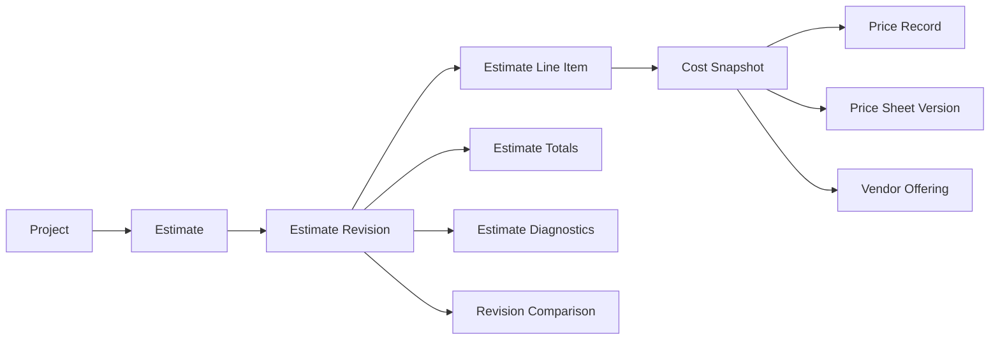
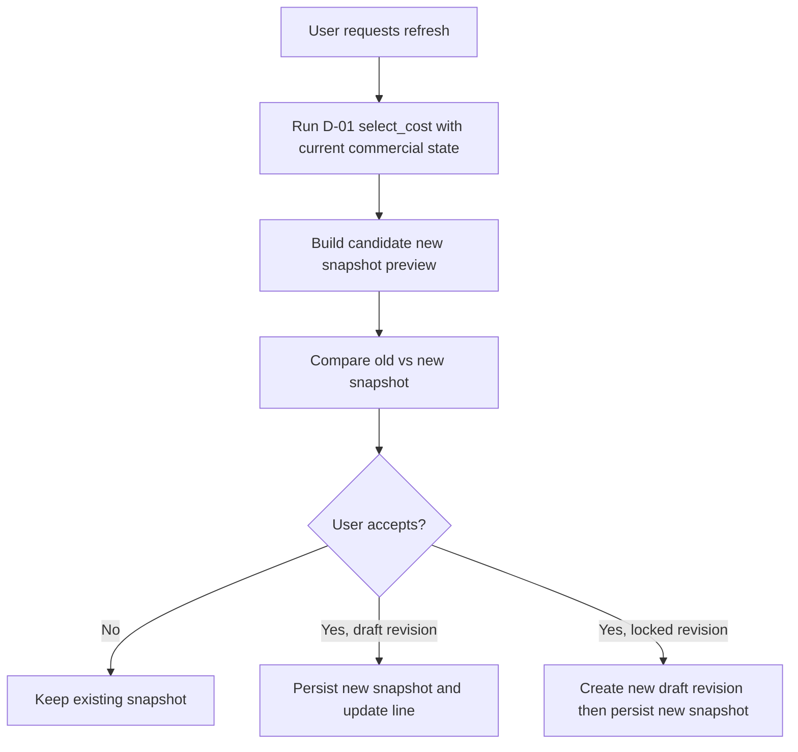
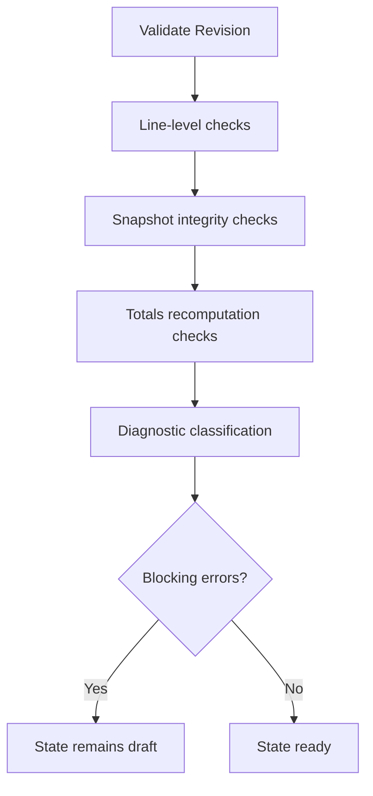

# Atlas Deterministic Estimating

## Related Documents
- [PRODUCT_VISION.md](PRODUCT_VISION.md)
- [DOMAIN_MODEL.md](DOMAIN_MODEL.md)
- [ARCHITECTURE.md](ARCHITECTURE.md)
- [DEVELOPMENT_STATUS.md](DEVELOPMENT_STATUS.md)
- [COMMERCIAL_KNOWLEDGE.md](COMMERCIAL_KNOWLEDGE.md)
- [PRICE_VERSIONING.md](PRICE_VERSIONING.md)
- [COST_ENGINE.md](COST_ENGINE.md)
- [PRICING_ENGINE.md](PRICING_ENGINE.md)
- [ASSEMBLIES_AND_LABOR.md](ASSEMBLIES_AND_LABOR.md)

## 1. Purpose
Sprint D-02 implements deterministic estimate identity, revision history, immutable cost snapshots, reproducible replay, and controlled cost refresh workflows.

D-02 builds on the closed D-01 Core Cost Selection Engine and does not replace or weaken D-01 selection behavior.

## 2. Scope and Non-Goals
D-02 scope:
- Estimate identity
- Estimate revision identity
- Estimate line items
- requested, engineering, and procurement quantities
- selected cost-source references
- immutable cost snapshots
- deterministic line extensions and totals
- cost refresh comparison
- revision history and replayability
- estimate validation and readiness gating

D-02 explicit non-goals:
- Product Resolution
- fuzzy matching
- assemblies and inferred accessories
- labor rollups
- sell pricing and margin packaging outside estimate/customer presentation controls
- freight, escalation, currency conversion calculations
- procurement, POs, accounting, ERP

D-03 implementation is complete for assemblies, accessories, and labor rollups. D-03 composes deterministic generated lines and labor snapshots through D-02 revision APIs while preserving D-01 cost-selection authority.

Sprint T-03 reuses this same deterministic estimate engine inside Transactions for the Estimates family. Transactions estimate line edits, revision workflows, validation, lock readiness, and issue controls compose the existing D-02/D-03 estimate model without introducing a separate estimate data model.

Sprint T-05 extends Transactions estimates with presentation controls for Internal Estimate and Customer Estimate views over the same revision identity, preserving one estimate source of truth.

Sprint T-09 adds Base Bid linkage behavior for project commercial tracking, allowing approved Estimate totals to be referenced as the primary Base Bid input for project change-order rollups without creating a separate Base Bid document type.

## 3.1 Estimate Presentation and Terms (T-05)

Estimate presentation behavior:
- Internal Estimate and Customer Estimate views reference the same estimate and revision
- no duplicate estimate line model is created for presentation variants
- customer view is a selective projection of shared estimate data

Terms and Conditions behavior:
- estimate drafts can capture tenant-scoped terms snapshots from explicit default/override resolution
- draft terms refresh requires explicit action
- issued estimate revisions preserve captured terms content and version immutably

## 3. D-01 Dependency Contract
D-02 consumes D-01 outputs and contracts:
- CostSelectionRequest
- CostSelectionResult
- CostProvenance
- CostSelectionDiagnostic
- CostSelectionResultStatus
- DeterministicCostEngine APIs documented in [COST_ENGINE.md](COST_ENGINE.md)

D-02 stores immutable snapshots of D-01 decisions and never re-derives historical locked revisions from mutable current lookups.

## 4. Estimate Object Model (Architecture)
The following are architecture objects for D-02 implementation planning. They are not implementation classes in this sprint.

### 4.1 Aggregate Objects
- Estimate
  - Stable project-scoped identity for an estimating container.
  - Owns revision history and default active draft pointer.
- EstimateRevision
  - Immutable-or-draft revision record under one Estimate.
  - Owns line items, diagnostics, and totals for one revision state.
- EstimateLineItem
  - Revision-scoped line record with quantity intent, product reference, and selected cost snapshot reference.
- CostSnapshot
  - Immutable snapshot of a D-01 cost selection decision at line scope.
- CostRefreshResult
  - Non-mutating comparison result between an existing snapshot and a reselection attempt.

### 4.2 Supporting Value Objects
- EstimateDiagnostic
  - code, severity, message, scope (estimate, revision, line), blocking flag, source refs.
- EstimateTotals
  - deterministic revision totals and confidence summary using Decimal-safe arithmetic.
- SnapshotReference
  - normalized reference set for vendor/offering/sheet/version/record identifiers.
- RevisionComparison
  - structured diff between revisions (added/removed/changed lines, cost/provenance deltas).
- ManualSelectionMetadata
  - reason, actor, timestamp, prior automatic result reference.

### 4.3 Required Identities
- estimate_id: stable, never reused, project-owned.
- revision_id: immutable identity per revision.
- revision_number: monotonic per estimate, no reuse.
- line_item_id: immutable identity within revision lineage.
- cost_snapshot_id: immutable identity tied to snapshot content hash and schema version.

### 4.4 Ownership and Relationships
- Project 1 -> N Estimate
- Estimate 1 -> N EstimateRevision
- EstimateRevision 1 -> N EstimateLineItem
- EstimateLineItem 0..1 -> 1 CostSnapshot
- EstimateRevision 1 -> N EstimateDiagnostic
- EstimateRevision 1 -> 1 EstimateTotals
- EstimateRevision 0..N -> 0..N CostRefreshResult (history)

### 4.5 Mutability Rules
- Estimate: mutable metadata, immutable identity.
- Draft EstimateRevision: mutable line composition and snapshot references.
- Locked/Superseded/Archived EstimateRevision: immutable.
- CostSnapshot: immutable immediately after creation; never edited in place.
- Diagnostics and totals are recomputed for draft, frozen at lock.

### 4.6 Audit Fields
All mutable operations must capture:
- created_at, created_by
- updated_at, updated_by
- locked_at, locked_by
- superseded_at, superseded_by
- reason fields for lock/supersede/manual selection/allowance use

## 5. Relationship Diagram

## 6. Estimate Lifecycle
Lifecycle states:
- draft
- validating
- ready
- locked
- superseded
- archived

Allowed transitions:
- draft -> validating
- validating -> draft
- validating -> ready
- ready -> draft
- ready -> locked
- locked -> superseded
- superseded -> archived

No transition from locked/superseded/archived back to mutable states.

Finalized revisions may not be deleted. Archival is status-based retention.

### 6.1 Editability by State
- draft:
  - add/update/remove lines
  - refresh snapshots
  - manual source selection with reason
  - recalculate totals
- validating:
  - no structural edits; validation execution only
- ready:
  - no implicit edits; explicit return to draft required
- locked/superseded/archived:
  - immutable data payload

## 7. Revision Model
Every material change must occur in a revision.

Required revision fields:
- revision_id
- revision_number
- estimate_id
- parent_revision_id (nullable for first revision)
- revision_reason
- created_by, created_at
- locked_by, locked_at
- superseded_by_revision_id, superseded_at
- ruleset versions (cost, estimate, snapshot schema)

Revision behavior:
- create_revision may clone prior revision lines by value.
- copied line snapshots remain referenced immutably until refreshed in draft.
- recalculated data is explicit and traceable to operation type.
- superseded revisions remain fully replayable.

A revision never mutates historical commercial facts. It only records references to immutable commercial artifacts through CostSnapshot.

## 8. Estimate Line Item Architecture
Each EstimateLineItem includes:
- stable line_item_id
- product reference (canonical product id)
- descriptive snapshot fields (manufacturer, model, description)
- requested_quantity
- engineering_quantity
- procurement_quantity
- unit_of_measure
- grouping references (section/system/room/origin object)
- selected vendor, vendor offering, price record references
- selected cost_snapshot_id
- extended acquisition cost
- source-selection status
- diagnostics
- user notes
- manual source selection metadata

Descriptive snapshot fields are copied into the line to preserve readability even if shared Product metadata changes later.

## 9. Cost Snapshot Schema
CostSnapshot is immutable and created from CostSelectionResult plus line context.

Required fields:
- cost_snapshot_id
- estimate_id, revision_id, line_item_id
- product_id
- vendor_id
- vendor_offering_id
- price_sheet_id
- price_sheet_version_id
- price_record_id
- source_filename
- source_file_hash
- source_reference (row/page/region)
- import_timestamp
- purchasing_channel
- source_currency
- source_unit_cost
- effective_unit_cost
- requested_quantity
- purchasable_quantity
- package_count
- excess_quantity
- extended_acquisition_cost
- effective_date
- expiration_date
- selection_rule
- tie_break_sequence
- confidence_score
- confidence_breakdown
- diagnostics
- selection_timestamp
- snapshot_created_at
- cost_engine_ruleset_version
- estimate_ruleset_version
- snapshot_schema_version

Derived quantity rule:
- excess_quantity = max(0, purchasable_quantity - requested_quantity)

## 10. Snapshot Immutability Rules
Creation events:
- line cost selection in draft
- explicit refresh acceptance in draft
- revision clone (references existing snapshot by id unless refresh is executed)

Replacement rules:
- draft line snapshot may be replaced only by explicit user acceptance.
- locked revision snapshots are never replaced.

Correction handling:
- corrected commercial pricing creates new commercial version and new snapshot in new draft revision.
- prior snapshots remain queryable and replayable forever.

Locking model:
- locking occurs at revision scope.
- line-level snapshots become effectively immutable as part of locked revision immutability.

## 11. Cost Refresh Workflow
Refresh is controlled and explicit.

Refresh output must show:
- unit and extended cost deltas
- vendor/vendor offering changes
- purchasing channel changes
- provenance field changes
- confidence and diagnostic changes

No silent refresh for historical revisions.

## 12. Historical Replay and Reselection
Historical replay:
- reproduces exact locked revision payload from stored snapshots and frozen totals.
- does not invoke live selection.

Historical reselection:
- reruns D-01 with specified as_of_date and selected commercial dataset/ruleset inputs.
- produces comparison output only unless explicitly accepted into new draft revision.

Atlas must distinguish:
- selected_then: stored snapshot decision
- selected_now: current rules/current commercial state reselection
- selected_for_historical_date_current_rules
- selected_for_historical_date_original_rules

## 13. Ruleset Versioning
Lightweight deterministic version identifiers:
- cost_engine_ruleset_version (from D-01 policy/version)
- estimate_calculation_ruleset_version
- snapshot_schema_version

Replay contract:
- locked revision records these versions.
- replay reads stored values and does not depend on current implicit defaults.

## 14. Deterministic Totals
Use Decimal-safe arithmetic for all totals.

Required totals:
- line extended acquisition cost
- subtotal by section
- subtotal by system
- subtotal by room
- estimate acquisition-cost total
- unresolved-cost total
- excluded-line total
- warning counts by severity
- confidence summary

Excluded in D-02 totals:
- sell price
- margin
- freight and escalation calculations
- tax
- labor rollup inference
- assembly/accessory inference

If labor/accessories appear as explicit imported line items, they may be totaled as explicit acquisition lines without inference.

## 15. Manual Cost-Source Selection
Manual selection behavior:
- estimator may choose a persisted PriceRecord reference.
- system validates with D-01 restriction and diagnostic model.
- snapshot retains full provenance and warnings.
- snapshot records automatic ranking bypass metadata.
- prior automatic result reference is stored for comparison where available.

D-02 does not allow arbitrary typed money overrides unless a separate controlled allowance object is introduced and approved.

## 16. Allowances and Missing Costs
Handled states:
- no_eligible_cost
- expired_cost_only
- future_cost_only
- unresolved_product
- unsupported_currency
- invalid_commercial_metadata
- explicit_allowance

Allowance lines:
- separate source-selection status from sourced product lines.
- require reason, actor, timestamp, approval state.
- cannot fabricate PriceRecord identifiers.
- use allowance provenance object with explicit allowance_source_class.

## 17. Validation and Readiness
Validation categories:
- errors (lock-blocking)
- warnings (review-required)
- informational

Representative lock-blocking rules:
- missing product reference where required
- missing snapshot on priced-required lines
- unresolved product references
- unsupported currency
- invalid quantities
- missing required provenance fields
- mutable reference detected for finalized revision
- blocked diagnostics present
- manual selection missing reason

Validation flow:

## 18. Service API Contracts (Design Only)
Proposed repository-consistent API surface:
- create_estimate
- create_revision
- add_line_item
- update_draft_line_item
- remove_draft_line_item
- select_line_cost
- create_cost_snapshot
- refresh_line_cost
- refresh_revision_costs
- compare_cost_snapshots
- validate_revision

## T-05 Amendment: Transactions Estimate Versioning and Export

Transactions estimate behavior extends deterministic estimate foundations with explicit controls:
- duplicate estimate as a new draft document identity
- create revision explicitly with reason and label
- preserve superseded revision history and parent lineage
- preserve immutable issued revisions
- archive/restore while retaining revision readability

Presentation and export behavior:
- Internal Estimate and Customer Estimate remain two views over one estimate revision
- deterministic PDF export is supported for both estimate presentations
- historical and archived revisions remain exportable
- calculate_revision_totals
- lock_revision
- clone_revision
- replay_revision
- list_revision_history

Contract rules:
- explicit request/response objects
- deterministic errors and diagnostics
- no implicit mutating side effects outside declared operation

## 19. Transaction Boundaries
Atomic operations required:
- create revision
- add/update/remove line item
- create snapshot
- refresh one line
- refresh all lines in revision
- lock revision
- clone revision

Rollback requirement:
- failed operation leaves prior state intact.
- no partially locked revision.
- no partially refreshed revision accepted as complete.

## 20. UI Architecture (Design Only)
Estimate workspace panels using existing Atlas patterns:
- estimate list
- revision selector
- line-item table
- cost-source inspector
- provenance drawer
- diagnostics panel
- totals panel
- refresh comparison panel
- revision comparison panel
- lock workflow
- Mission Control recommendations

Primary user questions answered:
- which estimate and revision are active
- what is missing or invalid
- what changed vs prior revision
- what actions are required to become lock-ready
- confidence and diagnostic posture

## 21. Mission Control Recommendations
Deterministic recommendations include:
- estimate has missing costs
- expired source pricing detected
- unresolved products present
- unsupported currency detected
- stale draft revision age threshold exceeded
- cost refresh available
- revision ready to lock
- locked revision superseded by newer pricing imports
- allowance lines requiring review

## 22. Backward Compatibility Strategy
Compatibility targets:
- current project BOM data
- existing estimate objects and services
- D-01 cost APIs
- Epic C commercial history model
- serialized project files
- existing reports and routes

Adapter posture:
- preserve existing Estimate service outputs.
- add revision-aware wrappers and persistence adapters.
- maintain old read paths during transition, then stage deprecation by versioned persistence flags.

Likely staged deprecations:
- single-estimate-per-project assumptions
- non-revisioned cost fields on transient BOM rows once revision snapshots become authoritative

## 23. Persistence Architecture (Design)
Persisted objects:
- estimates
- estimate_revisions
- estimate_line_items
- cost_snapshots
- revision_diagnostics
- revision_totals
- revision_comparisons
- refresh_results

Immutability:
- locked revisions immutable
- cost_snapshots immutable

Indexes and uniqueness:
- unique (estimate_id)
- unique (estimate_id, revision_number)
- unique (revision_id, line_item_id)
- unique (cost_snapshot_id)
- index by project_id, estimate_id, revision_state, updated_at
- index by snapshot provenance keys (price_record_id, price_sheet_version_id)

Foreign-key behavior:
- revision references estimate (restrict delete)
- line references revision (cascade on draft-only purge operations if allowed)
- snapshot references revision and line (restrict delete)

Deletion restrictions:
- locked/superseded/archived revisions not physically deleted.
- archive flags preferred over hard delete.

Migration strategy (planned, not implemented here):
- additive schema first
- dual-write optional transition window
- backfill snapshots for latest draft where feasible
- enable revision lock once validation parity confirmed

Source-reference retention:
- preserve source row/page metadata from snapshot provenance without relying on mutable external files.

## 24. Test Strategy for D-02 Implementation
Required test groups:
- object lifecycle and transitions
- revision creation/clone/supersede behavior
- snapshot immutability
- historical replay fidelity
- refresh comparison and acceptance flows
- Decimal totals
- transaction rollback integrity
- allowance handling
- validation and lock blocking
- backward compatibility adapters
- UI critical paths
- Mission Control recommendation determinism

Recommended test phases:
1. domain and service contract tests
2. persistence and transaction tests
3. replay and refresh regression snapshots
4. UI workflow tests
5. backward compatibility and migration dry-run tests

## 25. Implementation Order (Recommended)
1. Revision and snapshot domain contracts
2. Persistence schema and repositories (additive)
3. create_estimate/create_revision/clone_revision/list_revision_history
4. line item CRUD in draft
5. select_line_cost + create_cost_snapshot integration with D-01
6. totals + validation
7. lock workflow and immutability enforcement
8. refresh_line_cost and refresh_revision_costs
9. replay and comparison services
10. Mission Control recommendation integration
11. compatibility adapters and staged deprecations

## 26. Migration Considerations
Planned migration sequence:
1. create estimate/revision tables and snapshot storage
2. backfill current active estimate views into revision 1 drafts
3. derive snapshots for lines with existing D-01 trace references where lossless
4. mark unbackfillable lines with diagnostics requiring refresh
5. enable lock operation only after validation completeness gates are green

## 27. Risks
Highest-risk areas:
- preserving replay fidelity across ruleset evolution
- dual-state behavior during compatibility transition
- enforcing immutability without blocking practical refresh workflows
- snapshot schema drift and partial provenance
- transaction safety for bulk refresh and lock operations

## 28. Open Design Questions
1. Should draft snapshot replacement keep a full replacement chain per line or only prior pointer plus audit log?
2. Are lock approvals single-step or role-gated dual approval for high-value revisions?
3. What threshold defines stale draft revision for Mission Control recommendations?
4. Should refresh-all support partial acceptance batches or require full revision acceptance?
5. How should archived revisions participate in default revision comparison UX?

## 29. Go/No-Go Recommendation
Go for D-02 implementation planning and phased execution.

Rationale:
- D-01 dependency contracts are explicit and stable.
- D-02 object model, lifecycle, immutability, replay, refresh, validation, transaction boundaries, and compatibility posture are defined.
- Major design risks are identified with test and migration phases.

Gate before coding:
- finalize unresolved design questions above
- approve migration cutover policy
- approve lock governance policy
